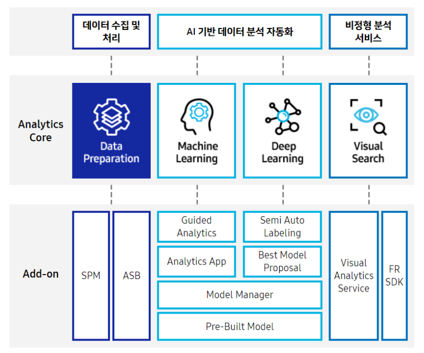

# Brightics AI
Brightics ai는 데이터 특성에 따른 최적 알고리즘 및 분석 파라미터 추천으로 누구나 손쉽게 데이터 분석을 할 수 있다고한다. 홈페이지에서는  4가지를 장점으로 이야기하고 있는데, 글만으로는 잘 와닿지는 않는다.  직접 사용해보며 정말 쉽게 할수 있는지 부딪쳐보자!

---

## Brightics AI 장점
- 사용자 중심 분석환경 
- 고속 데이터 처리 
- 스마트한 데이터분석 다양한 산업분야에 적용가능

### 자동화된 분석가이드 제공
각 단계별 분석과정을 설명하고 누구나 쉽게 분석할 수 있도록 친절한 가이드를 제공하여 뛰어난 분석결과를 얻을 수 있다.

### 대용량 데이터 고속처리 및 시각화 
대용량 데이터를 고속으로 처리함 최대 1억건의 행을 rendering 할 수 있다.

### 최적의 분석모델 추천 
분석환경과 데이터에 최적의 알고리즘 추천으로 현장 전문가도 원하는 분석결과를 내기위한 모델링을 손쉽게 할 수 있다.

### 검증된 BP 기반의 Pre-Built 활용으로 인사이트 확보
현장에 적용되어 이미 검증된 분석모델을 바로 업무에 활용 가능하기 때문에 
누구보다 빠르게 데이터기반의 인사이트를 확보할 수 있다.

---

## Brightics AI에서 제공되는 서비스
Brightics AI의 주기능 4가지는 데이터관리, 머신러닝, 딥러닝, 비쥬얼 데이터분석기능이다.

### 1. Data Preparation (DP)

데이터 수집, 저장 , 변환 , 탐색 기능을 기반으로 데이터를 표준화하고 통합하여 목적별로 활용할 수있도록 효과적이며 자동화된 데이터 운영 관리 서비스를 제공한다.

### 2. machine learning (ML)

Scala, Python , R, SQL 등 다양한 언어 기반 고성능 분석함수 지원, 데이터 특성에 따른 최적 알고리즘을 자동 추천, 자동 분석 시물레이션 환경 등 데이터 아키텍처의 확장성이 있는 고성능 기계학습 서비스를 제공한다.

### 3. deep learning(DL)

동영상/ 이미지에서 원하는 정보를 추출,분류하고 그 특징을 파악할 수 있도록 딥러닝을 활용한 비주얼분석 기능을 제공합니다. 

### 4. visual search(vs)

동영상 분석을 통해 콘텐츠의 내용과 시점을 검색 가능하도록 하여 원본 콘텐츠의 활용가치를 높여준다.

---

## Result
튜토리얼이 매우 잘 되어있어서 톧계관련 학과가 아닌 사람들도 쉽게 이해할 수 있다. 꼼꼼하게 정리되어있는 게 느껴졌다. Trial version으로도 할 수 있는 기능이 많아서 유료버전을 사용하지 않고 이용하는 유저도 몇몇 있을거라 생각이든다. 내부 공유용 데이터분석 자료를 만들기에 용이하단 생각이 들었다.  또한 사내 데이터분석 파이프라인을 구축할때 참고하면 좋을듯하다. Brightics 분석 WorkFlow를 참고하면 엄청 좋을 것이다. 그리고 **삼성sds에서 직접 사용법에 대한 강의를 무료로 해주고 있어서 라이센스 구매전에 꼭 들어보면 좋다.**    하지만 라이센스를 사서 분석결과를 바로 고객에게 제공할 정도는 아니다. 시각화부분이 다소 아쉬움이 있었다. 

---

## Reference

- [Brightics support](https://soa-park.tistory.com/entry/Brightics-AI-%EB%8D%B0%EC%9D%B4%ED%84%B0-%EB%B6%84%EC%84%9D-%ED%86%B5%ED%95%A9-AI%EC%9D%B8%EA%B3%B5%EC%A7%80%EB%8A%A5-%ED%94%8C%EB%9E%AB%ED%8F%BC-Brightics-AI-%ED%9A%8C%EC%9B%90%EA%B0%80%EC%9E%85-%EB%B0%8F-%EC%84%A4%EC%B9%98-%EB%B0%A9%EB%B2%95)
- [tutorial](https://www.brightics.ai/kr/docs/ai/v3.7/tutorials/00_create_project_model)
- [seanpark11님의 [Brightics] Brightics Studio 첫인상](https://seanpark11.tistory.com/18?category=827884)